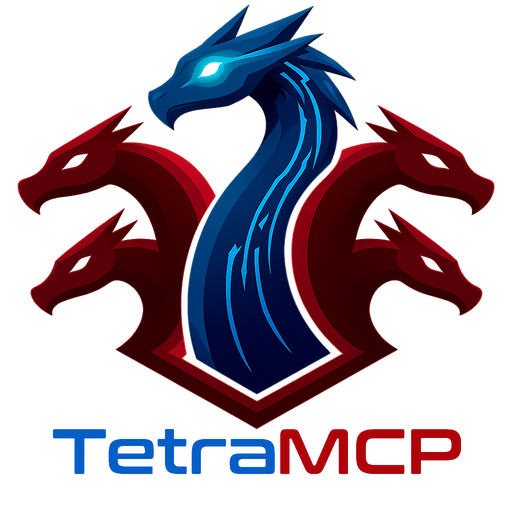

[](https://www.apache.org/licenses/LICENSE-2.0)
[](https://github.com/kronflux/TetraMCP/releases)
[](https://github.com/kronflux/TetraMCP/stargazers)
[](https://github.com/kronflux/TetraMCP/network/members)
[](https://github.com/kronflux/TetraMCP/graphs/contributors)


# TetraMCP for Ghidra

TetraMCP is a unified [Model Context Protocol](https://modelcontextprotocol.io/) (MCP) server for [Ghidra](https://ghidra-sre.org/), providing AI agents with direct access to reverse engineering capabilities.

TetraMCP extends Ghidra's three core perspectives -- hex, disassembly, and debugging -- with a fourth: an LLM cognition layer delivered via MCP. The result is a single Ghidra extension that turns any MCP-compatible AI client into a reverse engineering assistant.

<p align="center">

</p>

## Overview

TetraMCP integrates several key components:

1.  **Native MCP Server**: Runs directly inside Ghidra via an embedded Jetty server. No Python bridges or external processes are required; it communicates via Streamable HTTP.
2.  **Comprehensive Tooling**: Exposes 120+ tools across 25 categories, covering everything from decompilation and memory analysis to P-code emulation and AI-enhanced renaming.
3.  **AI Integration Layer**: Optional built-in support for LLMs (Anthropic, OpenAI, or compatible) to automate tasks like function explanation, variable renaming, and commenting directly within the analysis context.
4.  **Multi-Program Architecture**: Supports simultaneous analysis of multiple open binaries with isolated state management.

This architecture enables AI assistants to:
-   Decompile, disassemble, and analyze binary code with low-level precision.
-   Perform cryptographic constant detection and signature matching.
-   Utilize P-code emulation for dynamic behavior inspection.
-   Collaborate on complex reversing tasks using a shared context model for multi-agent systems.
-   Automate tedious renaming and documentation tasks via integrated AI.

## Features

TetraMCP provides a comprehensive set of reverse engineering capabilities organized into logical categories:

### Advanced Program Analysis
-   **Decompilation & Disassembly**: High-fidelity C decompilation and assembly listings with pagination support for large functions.
-   **Control Flow**: Generate control flow graphs (CFG) and call graphs to understand program logic.
-   **Data Flow**: Perform forward/backward data flow tracing via P-code SSA.
-   **Cross-References**: Query references to and from addresses, functions, and data symbols.

### AI-Enhanced Capabilities
-   **Automated Renaming**: Leverage LLMs to suggest meaningful names for functions and variables based on context.
-   **Code Explanation**: Generate function summaries and save them directly as plate comments.
-   **Line-by-Line Annotation**: Add detailed comments to decompiled code automatically.
-   **Log-Based Analysis**: Recover function names automatically from debug logging calls.

### Extensive Tooling
-   **Cryptographic Detection**: Scan for known constants (AES, SHA, MD5, etc.) using an embedded signature database.
-   **P-code Emulation**: Step through code, inspect registers, and modify memory state.
-   **External Tools**: Integration with `binwalk`, `YARA`, and specialized Go binary analysis.
-   **Multi-Agent Collaboration**: Shared findings, task queues, and progress tracking for complex workflows.

# Installation

## Prerequisites
-   [Ghidra](https://ghidra-sre.org/) (Version 12.0.4 or later)
-   JDK 21

## Ghidra Plugin Installation

First, download the latest release ZIP or build from source (see below). Then, add the plugin to Ghidra:

1.  Run Ghidra
2.  Select `File` -> `Install Extensions`
3.  Click the `+` button
4.  Select the `TetraMCP-[version].zip` file
5.  Restart Ghidra
6.  Open a binary in CodeBrowser
7.  Navigate to `File` -> `Configure` (plug icon) -> `Developer`
8.  Check **TetraMcpPlugin** to enable it

**TetraMcpPlugin is the only plugin you need to enable.** There is no companion
plugin to hunt for. TetraMCP learns that a program has closed from Ghidra
itself, by subscribing to the program's own close notification, so releasing a
closed program's cached decompilations and its native decompiler processes does
not depend on any second plugin being switched on.

> **Note:** The MCP server starts automatically on `http://localhost:18489/mcp`. You can customize the host and port in Ghidra under `Edit` -> `Tool Options` -> `TetraMCP`.

# Client Setup

TetraMCP works with any MCP-compatible client that supports **Streamable HTTP transport**.

### Claude Desktop Configuration

Add the following to your `claude_desktop_config.json`:
-   **macOS**: `~/Library/Application Support/Claude/claude_desktop_config.json`
-   **Windows**: `%APPDATA%\Claude\claude_desktop_config.json`

```json
{
  "mcpServers": {
    "tetramcp": {
      "type": "http",
      "url": "http://localhost:18489/mcp"
    }
  }
}
```

### Claude Code Configuration

Run the following command to add the server:

```bash
claude mcp add tetramcp --transport http http://localhost:18489/mcp
```

### Cursor Configuration

Create or edit `.cursor/mcp.json` in your project root:

```json
{
  "mcpServers": {
    "tetramcp": {
      "url": "http://localhost:18489/mcp"
    }
  }
}
```

## API Reference

TetraMCP organizes 120+ tools into logical namespaces.

### Program and Instance Management
-   `program_info`: Program metadata (name, architecture, compiler, hashes).
-   `instances_list`: List open programs.
-   `instances_use`: Switch active program context.

### Function Analysis
-   `functions_decompile`: Decompile to C with pagination.
-   `functions_disassemble`: Assembly listing.
-   `functions_rename`: Rename functions.
-   `functions_find_undefined`: Discover undefined code.

### Memory and Data
-   `memory_read`: Hex dump with ASCII.
-   `memory_search_bytes`: Pattern search with wildcards.
-   `data_list_strings`: List strings with regex filtering.
-   `structs_create` / `structs_update_field`: Manage data structures.

### Analysis and AI
-   `analysis_callgraph`: Generate call graphs.
-   `analysis_cfg`: Control flow graphs.
-   `ai_suggest_renames`: LLM-powered renaming suggestions.
-   `ai_explain_function`: Auto-generate function summaries.

### Emulation
-   `emulation_create`: Start a P-code emulator.
-   `emulation_step`: Step execution.
-   `emulation_get_state`: Inspect registers and memory.

### Multi-Agent
-   `agents_add_finding`: Record analysis findings.
-   `agents_get_next_task`: Coordinate workflow tasks.

## Example Session

Below is an example of how an AI assistant might interact with Ghidra using TetraMCP:

**User:**
```
Find the main function, explain what it does, and check for any cryptographic constants.
```

**Assistant:**
```
I'll start by locating the main function and analyzing it.

[Uses functions_list with filter "main"]
Found 'main' at address 0x00401000.

[Uses functions_decompile for 'main']
Retrieved decompiled code. The function initializes a socket and encrypts data before sending.

[Uses ai_explain_function for 'main']
LLM Explanation: This function serves as the entry point for the network handler. It allocates a buffer, initializes a cryptographic context, and enters a loop to process incoming data packets.

[Uses crypto_scan on the current program]
Cryptographic constants detected:
- AES S-Box at 0x00402000
- SHA-256 IV at 0x00402100

I have added a plate comment to 'main' with the generated explanation and identified the crypto constants used.
```

**User:**
```
Rename the buffer variable in main to 'packet_buffer' and check cross-references to the AES S-Box.
```

**Assistant:**
```
[Uses variables_rename in function 'main' old_name 'buffer' new_name 'packet_buffer']
Variable renamed successfully.

[Uses xrefs_to address 0x00402000]
Found 2 references to the AES S-Box:
- encrypt_data (0x00401150)
- decrypt_data (0x00401230)

The cryptographic functions have been identified. Would you like me to analyze the 'encrypt_data' function next?
```

# Configuration

Server and AI settings are configured in Ghidra under **Edit > Tool Options**.

### Server Settings (TetraMCP)
| Setting | Default | Description |
|---------|---------|-------------|
| Server Host | `127.0.0.1` | Bind address |
| Server Port | `18489` | HTTP port |

### AI Settings (TetraMCP.AI)
| Setting | Default | Description |
|---------|---------|-------------|
| AI Enabled | `false` | Enable AI-assisted analysis |
| AI Provider | `anthropic` | `anthropic` or `openai` |
| AI Model | `claude-sonnet-4-6` | Model name |

**Local Models (Ollama example):** Set Provider to `openai`, API URL to `http://localhost:11434/v1/chat/completions`, leave API Key empty, and set Model to your model name.

# Architecture

TetraMCP runs as a single Java codebase inside the Ghidra JVM, eliminating the need for bridge scripts or serialization boundaries.

```
MCP Client (Claude, Cursor, etc.)
    |
    | Streamable HTTP (:18489/mcp)
    |
Jetty 12 (embedded HTTP server)
    |
MCP Java SDK
    |
Tool Providers (27 providers, 120+ tools)
    |
Ghidra APIs (FlatProgramAPI, DecompInterface, etc.)
```

## Extending with Custom Tools

Implement `TetraMcpModule` and register via Java's `ServiceLoader`:

```java
public class MyModule implements TetraMcpModule {
    public String getName() { return "MyTools"; }
    public List<ToolSpecification> getToolSpecifications(McpServerManager mgr) {
        // Return tool definitions
    }
}
```

# Building from Source

**Requirements:** JDK 21, Ghidra 12.0.4 or later.

```bash
export GHIDRA_INSTALL_DIR=/path/to/ghidra
./gradlew buildExtension
```

The extension ZIP is created in `dist/`.

# License

Apache License 2.0. See [LICENSE](LICENSE) for the full text.

# Acknowledgments

-   [Ghidra](https://ghidra-sre.org/) by the National Security Agency
-   [Model Context Protocol](https://modelcontextprotocol.io/) specification
-   [MCP Java SDK](https://github.com/modelcontextprotocol/java-sdk)
